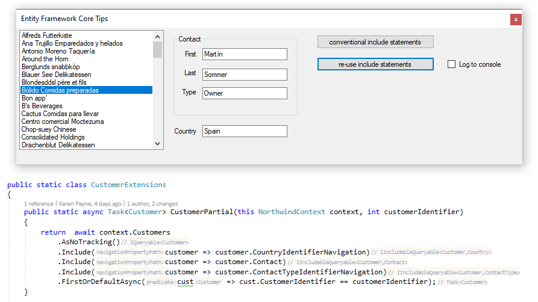

# Entity Framework Core tips for WinForms

Find the Microsoft TechNet [article here](https://social.technet.microsoft.com/wiki/contents/articles/53635.entity-framework-corewindows-forms-tips-and-tricks.aspx).

